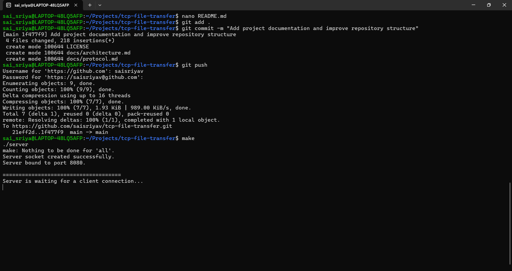
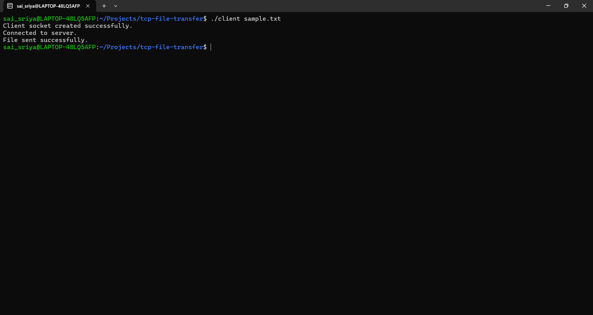
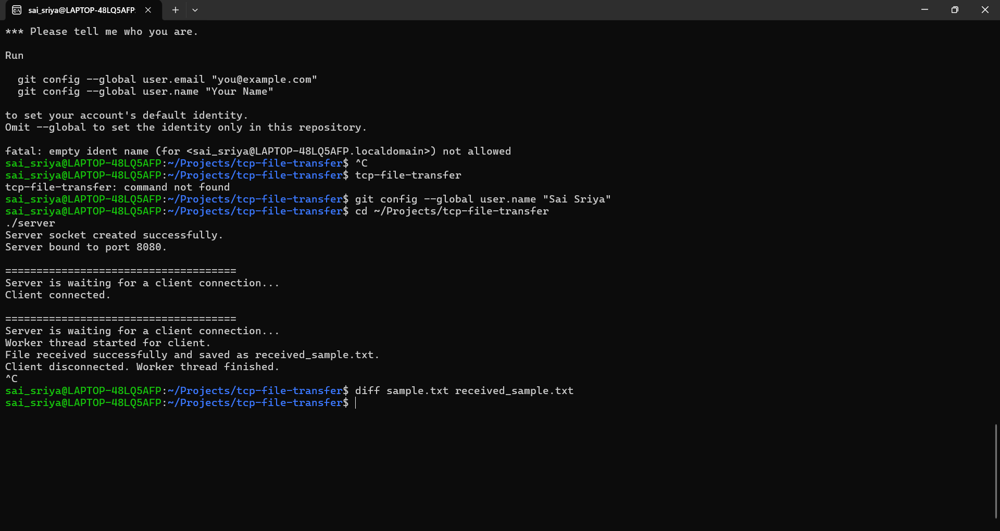

# TCP File Transfer Application

A multithreaded TCP-based file transfer application developed in C on Linux using POSIX sockets and pthreads. The application allows a client to transfer files reliably to a server over TCP while supporting concurrent client connections through multithreading.

---

## Project Highlights

- Multithreaded TCP server using POSIX Threads
- Reliable file transfer over TCP
- Custom application-layer protocol
- Dynamic filename support
- Robust `send_all()` and `recv_all()` implementations
- Command-line interface
- Linux-based implementation
- Makefile build automation

---

## Repository Structure

```
tcp-file-transfer/
│
├── src/
│   ├── client.c
│   └── server.c
│
├── docs/
│   ├── architecture.md
│   └── protocol.md
│
├── screenshots/
│
├── Makefile
├── README.md
├── LICENSE
├── sample.txt
└── .gitignore
```

---

## Documentation

- 📄 `docs/protocol.md` — Application-layer protocol specification
- 📄 `docs/architecture.md` — System architecture and threading model

---
## Features

- TCP client-server communication
- Multithreaded server using POSIX threads (pthread)
- Reliable file transfer over TCP
- Custom application-layer protocol
- Dynamic filename support
- Command-line file selection
- Reliable metadata transfer using send_all() and recv_all()
- Error handling for socket, file, and connection failures
- Linux-based implementation

---

## Technologies Used

- C
- Linux
- POSIX Sockets
- POSIX Threads (pthread)
- GCC
- Make

---

## Project Structure

```
tcp-file-transfer/
│
├── Makefile
├── README.md
├── client.c
├── server.c
├── sample.txt
├── client
├── server
└── received_sample.txt
```

---

## Architecture

```
                Client
                   │
              TCP Connection
                   │
                   ▼
         +----------------+
         |     Server     |
         +----------------+
                   │
              accept()
                   │
         pthread_create()
                   │
          +----------------+
          | Worker Thread  |
          +----------------+
                   │
        Receive Metadata
                   │
         Receive File Data
                   │
          Save Received File
```

---

## Application Protocol

The application uses a custom protocol for reliable communication.

```
+------------------------+
| Filename Length (4B)   |
+------------------------+
| Filename (N bytes)     |
+------------------------+
| File Size (8B)         |
+------------------------+
| File Data              |
+------------------------+
```

This protocol allows the server to determine:

- The exact filename length
- The filename
- The expected file size
- When the transfer is complete

---

## Build

Compile the project using:

```bash
make
```

Clean generated files:

```bash
make clean
```

---

## Running the Application

Start the server:

```bash
./server
```

Start the client:

```bash
./client sample.txt
```

---

## File Verification

Verify the transferred file:

```bash
diff sample.txt received_sample.txt
```

If no output is produced, the transfer was successful and both files are identical.

---

## Key Concepts Demonstrated

- TCP Socket Programming
- Client-Server Architecture
- Linux System Programming
- POSIX Threads
- File I/O
- Dynamic Memory Allocation
- Thread Synchronization Concepts
- Custom Network Protocol Design
- Reliable Data Transmission
- Error Handling

---

## Future Improvements

- Transfer progress indicator
- File checksum validation
- TLS encryption
- Multiple file transfer support
- Resume interrupted transfers
- Logging framework
- Configuration file support
- IPv6 support

---

## Author

Sai Sriya
---

# Screenshots

## Server Execution

The server initializes a TCP socket, binds to port **8080**, and waits for incoming client connections.



---

## Client Execution

The client establishes a TCP connection and transfers the selected file to the server.



---

## File Integrity Verification

The received file is compared with the original using the Linux `diff` command. Since `diff` produces **no output**, the transfer was successful and both files are identical.


