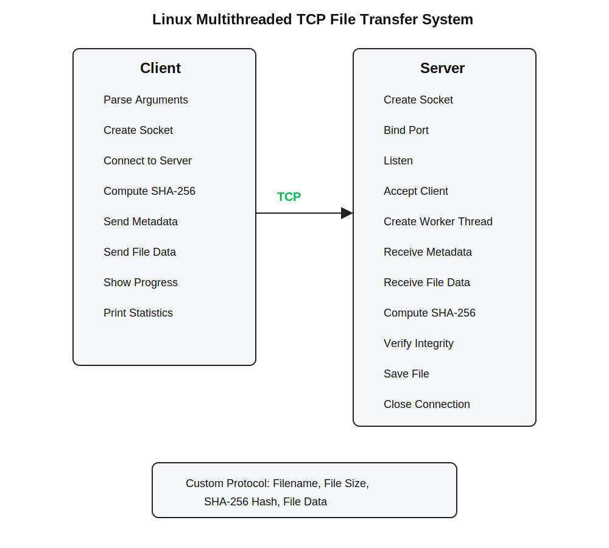
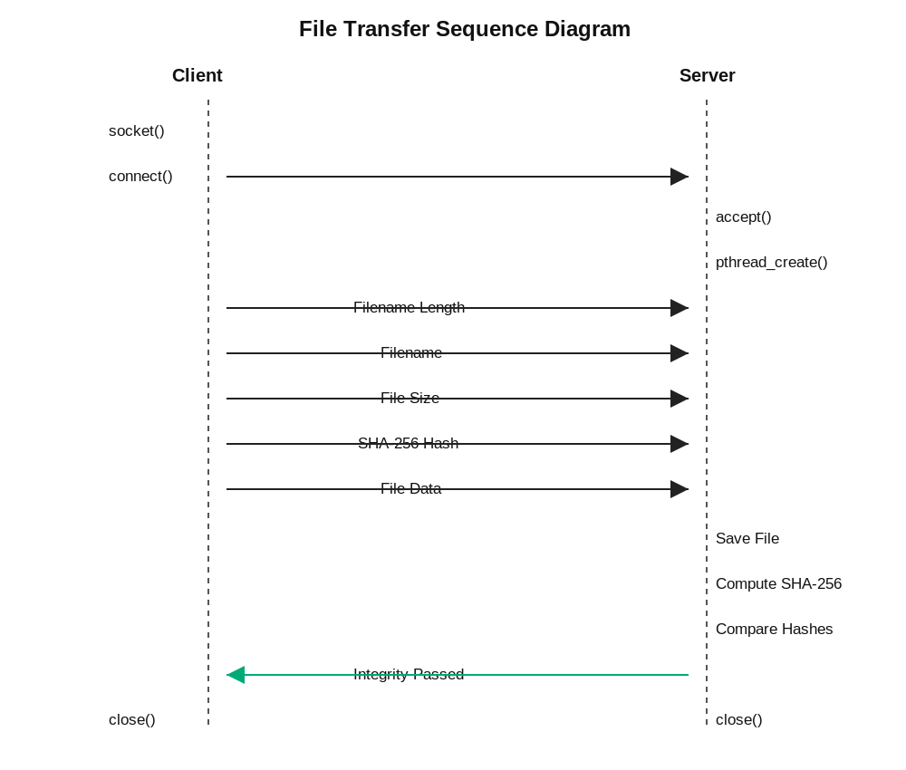
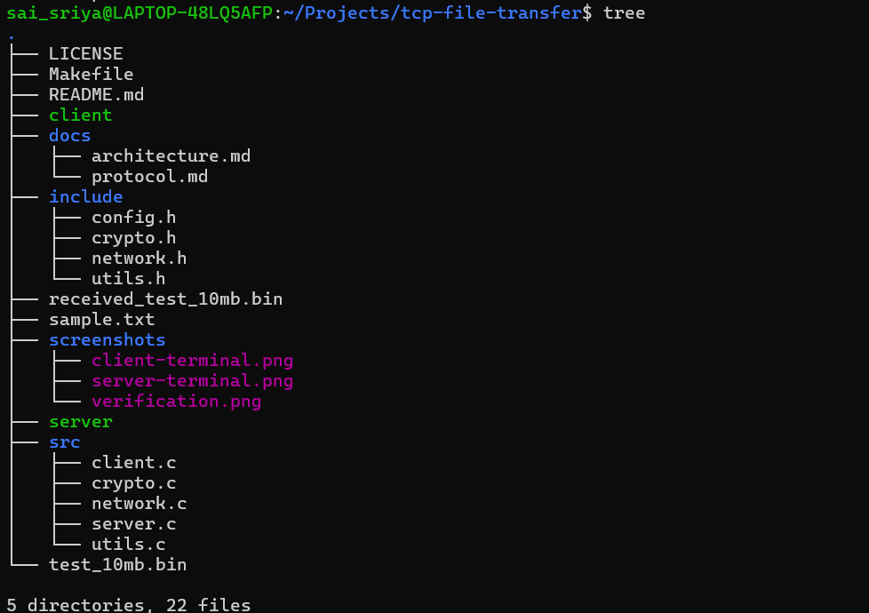

# Linux Multithreaded TCP File Transfer System

A high-performance TCP client-server file transfer application developed in **C** on **Linux** using **POSIX sockets** and **POSIX threads**. The application supports reliable file transmission, concurrent client handling, configurable networking, real-time transfer monitoring, performance analysis, and SHA-256 integrity verification through a custom application-layer protocol.

---

## Overview

This project demonstrates the implementation of a production-style TCP file transfer system built using low-level Linux networking APIs. The application emphasizes reliable communication, modular software design, concurrent programming, and secure file verification.

The client transfers files to the server over TCP while transmitting metadata required for reconstruction and integrity validation. Each client connection is handled independently using POSIX threads, allowing multiple clients to be served concurrently.

---

## Key Features

- TCP client-server architecture
- POSIX socket programming
- Multithreaded server using POSIX Threads
- Concurrent client handling
- Configurable server IP address and port
- Reliable data transmission using `send_all()` and `recv_all()`
- Custom application-layer protocol
- Binary file transfer support
- Real-time transfer progress
- Transfer performance statistics
- SHA-256 integrity verification
- Structured logging
- Modular software architecture
- Build automation using Make

---

## System Architecture


---

## Project Structure

```text
tcp-file-transfer/
│
├── include/
│   ├── config.h
│   ├── crypto.h
│   ├── network.h
│   └── utils.h
│
├── src/
│   ├── client.c
│   ├── server.c
│   ├── network.c
│   ├── crypto.c
│   └── utils.c
│
├── docs/
│   ├── architecture.md
│   └── protocol.md
│
├── screenshots/
│
├── Makefile
├── README.md
└── LICENSE
```

---

## Application Protocol


---

## Build

Install OpenSSL development libraries:

```bash
sudo apt update
sudo apt install libssl-dev
```

Compile the application:

```bash
make clean
make
```

---

## Usage

Start the server:

```bash
./server
```

Custom port:

```bash
./server 8080
```

Transfer a file:

```bash
./client sample.txt
```

Specify server IP and port:

```bash
./client 127.0.0.1 8080 test_10mb.bin
```

---

## Screenshots

### Client


### Server


### SHA-256 Verification


### Project Structure



---

## Skills Demonstrated

- C Programming
- Linux System Programming
- POSIX Socket Programming
- TCP/IP Networking
- Client-Server Architecture
- Concurrent Programming
- POSIX Threads
- Custom Application Protocol Design
- SHA-256 Cryptographic Hashing
- Binary File Transfer
- Performance Measurement
- Error Handling
- Modular Software Design
- Build Automation using Make

---

## Future Enhancements

- TLS encryption
- IPv6 support
- Multiple file transfer
- Resume interrupted transfers
- Configuration file support
- Timestamped logging
- Bandwidth throttling
- File compression

---

## License

This project is released under the MIT License.
